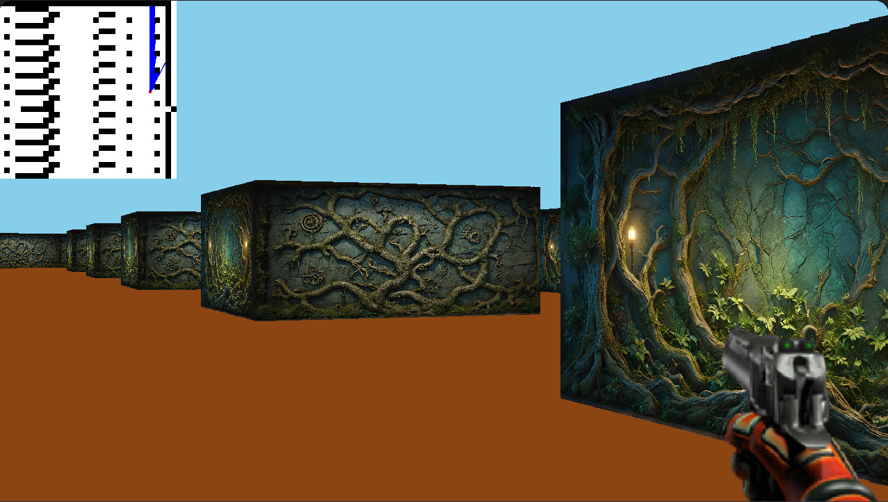

# CUB3D

A 3D graphics project inspired by the famous Wolfenstein 3D game, developed as part of the 42 school curriculum. This project aims to create a dynamic view inside a maze using raycasting techniques.



## Table of Contents
- [Installation](#installation)
- [Usage](#usage)
- [Features](#features)
- [Contributing](#contributing)
- [License](#license)

## Installation

```bash
git clone https://github.com/Chamuraii/Cub3D.git
cd Cub3D
make all
```

For the complete project with bonus features:

```bash
make bonus
```

## Usage

To run the program:

```bash
./cub3D maps/map.cub
```
To run the program with bonus:

```bash
./cub3D_bonus maps/map.cub
```

Replace `map.cub` with the path to your map file.

Controls:
- W, A, S, D: Move the player
- Left/Right arrow keys: Rotate the camera
- ESC: Exit the game

## Features

- Raycasting technique for rendering 3D-like environments
- Textured walls
- Collision detection
- Customizable map parsing

Bonus features:
- Minimap display
- Wall collisions
- Animated sprite
- Move camera with mouse (Only works on MacOs because of the MLX library)

## Contributing

This project is part of the 42 school curriculum. While contributions are not expected, feel free to fork the project for your own learning and experimentation.

## License

This project is licensed under the AGPLv3 License - see the [LICENSE](LICENSE) file for details.
